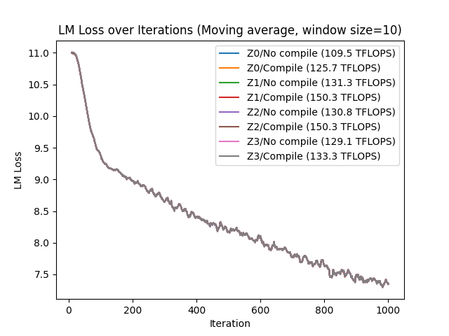

# Run with torch.compile (Experimental)

This folder contains an example that enables `torch.compile`.


## Enable `torch.compile`

This example tested with the followings:

- PyTorch [f614ed7](https://github.com/pytorch/pytorch/commit/f614ed78b8b8521900385542d515e60520915ca3)
-- The nightly revision as of Dec 8, 2023
-- We recommend using the latest nightly revision
- DeepSpeed [tohtana/compile-zero](https://github.com/microsoft/DeepSpeed/tree/tohtana/compile-zero)

You need to add `compile` section in your DeepSpeed config. The fields in the section are passed to `torch.compile`.

```json
  "compile": {
    "disable": false,
    "backend": "inductor"
  },
```

Only the small extension is on `backend`. To enable a custom backend, you can pass the fully qualified name of the backend funciton, . For example, if you have a backend class `my_backend` in `my_backend.py` in the current directory, you can enable it by `"backend": "my_backend.my_backend"`.

`run.sh` in this folder shows how to run with `torch.compile`.
`run_validation.sh` runs different configurations to verifies the results.

## Verification

The following chart shows TFLOPS and loss curves resulting from No ZeRO and ZeRO 1/2/3.

- Sequence length: 2048
- Global batch size: 4
- Model: GPT-1.3B
- GPUS: 4x A100 (80GB)


